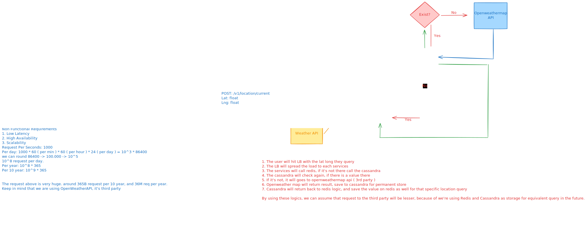

# Architecture Diagram

Weather API is purpose of returning the weather condition when provided latittude and longitude of the current location.
It will return either sunny, rain, cloudy.

We will depends on Openweathermap API as a third party.

## Functional Requirements

1. Able to get current location weather
2. Able to find other location weather

## Non Functional Requirements
1. Low Latency
2. High Availability
3. Scalability
   Request Per Seconds: 1000

   Per day: 1000 * 60 * 60 * 24 = 10^3 * 86400
   
   we can round 86400 -> 100.000 -> 10^5
   
   10^8 request per day.
   
   Per year: 10^8 * 365
   
   Per 10 year: 10^9 * 365

The request above is very huge. around 365B request per 10 year, and 36M req per year.
Keep in mind that we are using OpenWeatherAPI, it's third party, and it's not free!

## Propose diagram

### Tech Stack
1. Go
2. Redis
3. Cassandra
4. Docker
5. Kubernetes

### Flow
1. The user will hit our API, which is /api/v1/weather/search
2. It will hit load balancer, our kubernetes will has like 3 replicas for this services.
3. Load balancer ( usually ingress ) will separate the load and use service discovery to select which one processing the request
4. Weather service will try pickup from redis first, if it's exist return the value from redis
5. If the value not exist from redis, it will check from cassandra, do we have the value on cassandra or not.
6. If the value exist in cassandra, return it and save in redis.
7. If it's not, let's pickup from OpenweatherAPI
8. After return the value from OpenweatherAPI, we will save the value into cassandra and redis
9. The value on cassandra will be removed every 10-20mins, so it will not has a data invalidation.
10. Redis will has TTL of 5mins.
11. The strategy to store Redis key and Cassandra partition key is using "lat,lon" value that combined to a string, later we can just splitted it if we can to get each value.

